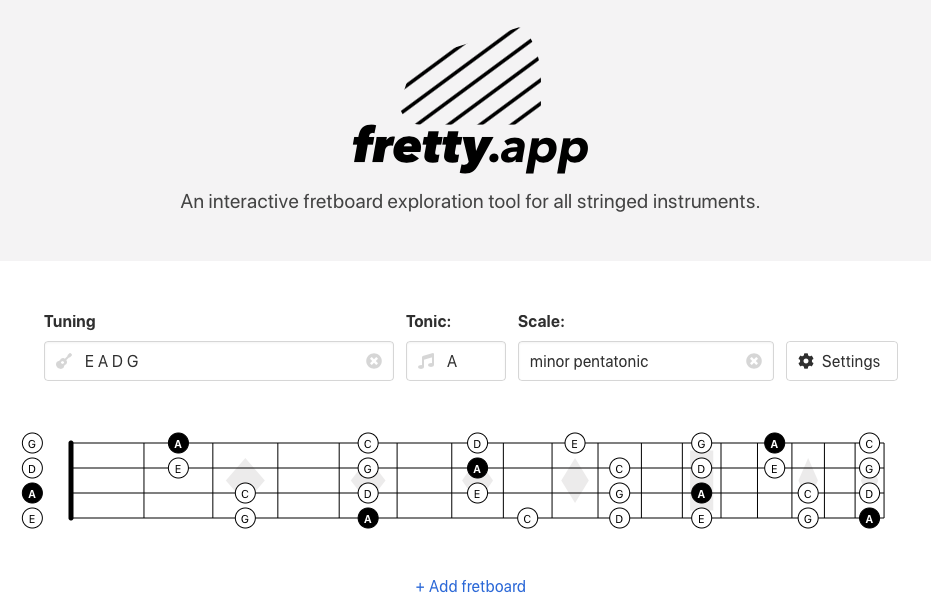

I grew up in a very musical family and play the guitar since I was a teenager.
I received a lot of music lessons but for some reason music theory never really stuck - I got lost super fast when the teachers started rambling about scales, modes, tonalities... I mean, come on. Naming and notation in music is bonkers.

So this month I started learning music theory by myself. And surprise - a lot of the things
my teachers explained back then suddenly make sense. But I feel as an easily confused programmer I need to get to the root of complex systems to understand them.

> _For me, a good way to learn complex topics has always been to express the problem as code._

Even better: Make it interactive. Then you learn it while playing with it.

<a href="https://fretty.app" target="_blank">fretty.app</a> was born.
